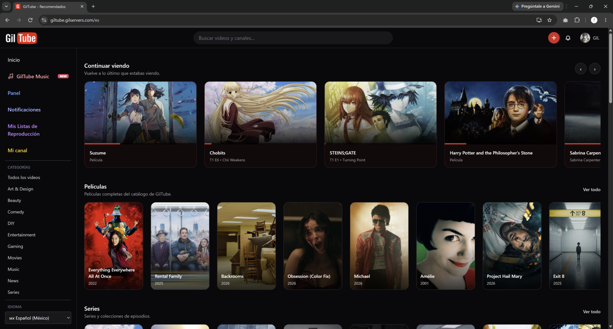
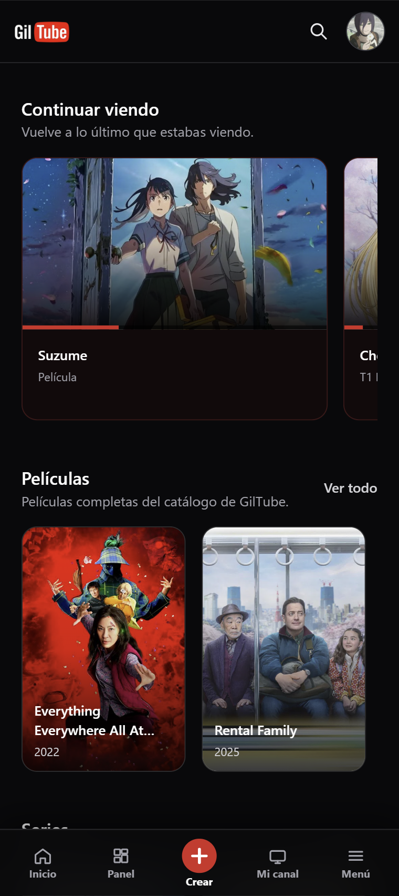
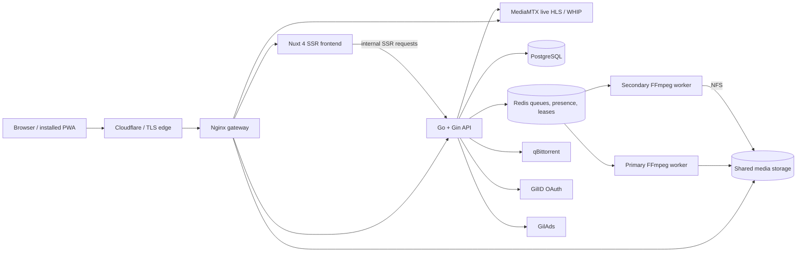

<p align="center">
  
</p>

<p align="center">
  A self-hosted video, movie, series, live-streaming, and high-resolution music platform.<br>
  Built as a full-stack portfolio project and operated as a real multi-service deployment.
</p>

<p align="center">
  <a href="https://giltube.gilservers.com"><strong>Open GilTube</strong></a>
  ·
  <a href="https://github.com/gil-666">Developer profile</a>
</p>

<p align="center">
  
  
  
  
  
  
</p>

## Live application

**Public URL:** [https://giltube.gilservers.com](https://giltube.gilservers.com)

The public instance is the working product, not a static design mockup. It runs the Nuxt SSR application, Go API, PostgreSQL, Redis-backed jobs and presence, FFmpeg media workers, persistent media storage, and an Nginx gateway behind the production edge.

<p align="center"><strong>Desktop</strong></p>

<p align="center">
  
</p>

<p align="center"><strong>Mobile</strong></p>

<p align="center">
  
</p>

## What GilTube is

GilTube began as a video-sharing application and grew into a broader media platform. One account can own multiple channels, upload videos, broadcast live, organize a movie or episodic catalog, publish music releases, and participate socially without splitting those identities across separate products.

The project is designed around the entire media lifecycle:

1. Ingest a large source file without depending on one oversized HTTP request.
2. Inspect its streams and metadata with FFprobe.
3. Queue durable background work through Redis.
4. Produce adaptive playback formats with FFmpeg.
5. Preserve language, ownership, rights, and catalog relationships in PostgreSQL.
6. Deliver responsive SSR pages, installable PWA behavior, and rich link previews.
7. Recover interrupted work and distribute encoding across more than one machine.

## Product capabilities

### Video platform

- Chunked uploads suitable for large files and Cloudflare request limits.
- Adaptive HLS playback with source-aware renditions from SD through 4K/8K when available.
- Video.js controls, manual quality selection, alternate audio, captions, Picture-in-Picture, keyboard controls, and remembered language preferences.
- Source-aspect-aware encoding and quality badges for landscape, portrait, square, and non-standard resolutions.
- Upload progress, durable transcode status, resumable encoding, custom thumbnails, generated thumbnails, and downloadable qualities.
- Mature-content interstitials that stop playback until acknowledged.
- Clips, threaded comments, comment likes, GIF replies, video likes, watch history, and recommendations.
- Public, unlisted, and private playlists with ordering and continuous queue playback.
- Search across videos, channels, movies, and series.
- A dedicated not-found state for missing or unavailable videos.

### Channels and accounts

- Multiple channels under one account with a database-synced default channel.
- Fast channel switching from desktop and mobile account panels.
- Channel avatars, backdrops, generated responsive image variants, verification, analytics, and custom HTML/CSS themes.
- Separate account and channel identity: switching a channel does not require a second login.
- Email/password authentication, GilID OAuth integration, and WebAuthn passkeys.
- Account-level playback-language and music-quality preferences synchronized across devices.

### Movies and series

- Dedicated movie and series catalogs with feature heroes, genre rows, posters, backdrops, cast, directors, synopsis, runtime, and watch progress.
- Fluid detail windows with sticky artwork/title/quality headers and scrollable metadata.
- Expandable long synopses and media capability summaries for maximum quality, audio languages, and caption languages.
- Episode grouping by season, episode reordering, original filename visibility, trailers, intro timing, and community intro-skip suggestions.
- Existing user uploads can be linked into the catalog without transferring video ownership.
- Catalog-linked videos are protected from accidental deletion until the registry relationship is removed.
- Alternate audio and subtitle tracks can be attached, labeled, made default, downloaded, replaced, delayed, trimmed, and synchronized.
- Saved audio and caption language preferences fall back gracefully when a requested language is unavailable.

### Live streaming and watch parties

- RTMP and browser-based WHIP publishing through MediaMTX.
- HLS live playback, live presence, viewer counts, channel chat, detachable chat windows, and stream-key rotation.
- Optional DVR recording that becomes a normal GilTube VOD after a stream ends.
- Redis-backed recording leases prevent multiple workers from recording the same live stream.
- Synchronized watch parties with host controls, shared queues, chat, invitations, visibility settings, and saved progress.

### GilTube Music

<p>
  
</p>

- A distinct music experience with home, search, library, artist, release, and track pages.
- Albums, EPs, and singles with release-level copyright, phonogram, territory, and publishing-rights confirmation.
- Music-only artists are supported; an artist may optionally map to one primary GilTube channel.
- FLAC, WAV, ALAC, MP3, AAC, M4A, OGG, and Opus ingestion.
- Original lossless masters are retained while 128, 256, and 320 kbps AAC versions are generated for constrained bandwidth.
- Auto, Low, Medium, High, and Maximum playback preferences; Maximum can serve the original lossless master.
- Hi-Res Audio presentation includes detected bit depth and sample rate.
- Persistent queue, shuffle, repeat, volume, full player, mini-player, cover-art motion, and mobile swipe navigation.
- Synced and plain lyrics, LRCLIB lookup, active-line scrolling, and click-to-seek karaoke interaction.
- Official music videos can link a track to an existing GilTube video without duplicating the media.
- Quick Upload accepts multiple tracks, reads file metadata, extracts embedded artwork, resolves conflicting tag sources, and creates ordered releases in one workflow.
- Release and track pages render SSR metadata for title, artist, description, and social cover previews.

### Administration and media operations

- User and channel moderation, admin promotion, suspension, bans, and catalog management.
- Video, movie, series, artist, release, and track editors.
- Redis-backed transcode jobs with progress, pause/cancel controls, retries, recovery after restart, and completed-rendition detection.
- Authorized torrent ingest through qBittorrent plus direct single-file and multi-file local ingest.
- Automatic episode inference from filenames, manual mapping, exclusions, bulk attachment, and post-ingest episode reordering.
- Audio and subtitle extraction from ingested files, bulk episode linking, timing adjustment, and cross-source synchronization.
- Completed source files can be deleted to reclaim storage while retaining ingest history.
- YouTube mirror administration through yt-dlp.
- GilAds banner/video placements and event reporting.
- Responsive image generation and backfill tools for previously uploaded avatars, backdrops, thumbnails, artist images, and cover art.

### Platform experience

- Nuxt server-side rendering for public pages and social metadata.
- Installable PWA with a custom Workbox service worker, push notifications, and controlled media caching.
- English and Spanish localization, including admin and media workflows.
- User-agent-aware mobile navigation with music-specific navigation inside GilTube Music.
- Desktop, phone, and tablet layouts built as operating interfaces rather than separate demo pages.
- Accessible labels, focus states, semantic controls, and reduced accidental interaction during swipe gestures.

## Architecture



### Request model

- Browser API calls use the same-origin `/api/v1` path through Nginx.
- Nuxt SSR requests use `NUXT_API_INTERNAL_URL` to reach the API directly over the container network.
- Static video renditions are served from shared storage under `/videos/`.
- Protected music masters and generated audio variants are served through `/music-assets/` and API-controlled master endpoints.
- Live WHIP and HLS paths are routed to MediaMTX, while `/live/:channelId` remains a Nuxt page route.

### Media storage

The production layout separates small service state from large media:

```text
/srv/giltube/
  postgres/                 PostgreSQL data
  redis/                    Redis append-only data

/mnt/storage/giltube/data/
  output/                   HLS video, music masters, and generated renditions
  downloads/                Prepared downloads
  uploads/                  Chunked upload sessions
  staging/                  Temporary ingest and transcode work
  avatars/                  Avatar image sets
  channel-backgrounds/      Channel backdrop image sets
```

Secondary workers mount the media root over NFS and consume jobs from the same Redis queue. This keeps one authoritative media copy while allowing encoding capacity to scale horizontally.

## Media pipelines

### Video upload and transcode

```text
Browser chunks
  -> upload session
  -> finalized source file
  -> PostgreSQL video record
  -> Redis transcode job
  -> FFprobe stream inspection
  -> FFmpeg HLS renditions + audio/subtitle metadata + thumbnails
  -> master playlist
  -> published playback
```

The worker does not upscale merely to fill a standard ladder. It determines available outputs from both source dimensions, which lets non-standard 4K media retain the correct quality classification. HDR sources can be tone-mapped to BT.709 for compatible outputs. Interrupted work is resumable: completed variants with valid playlists and segments are skipped on retry.

### Music ingest

```text
Chunked audio upload
  -> master retained in its original format
  -> FFprobe codec / container / sample rate / bit-depth detection
  -> AAC 128k + 256k + 320k encodes
  -> optional embedded cover extraction
  -> release publication
```

The player selects a stream from the user's saved preference and network conditions. Lossless delivery goes through an API endpoint that supports range requests rather than exposing the master directory directly.

### Alternate language ingest

Media Ingest can inspect a second source, list its audio and subtitle streams, infer episode matches from filenames, and append selected tracks to existing movies or episodes. The synchronization editor compares original and added audio and applies delay or start trimming without replacing existing tracks.

## Technology stack

| Layer | Technology |
| --- | --- |
| Web application | Nuxt 4, Vue 3, TypeScript |
| Styling | Tailwind CSS plus scoped component CSS |
| Video playback | Video.js, HLS.js, videojs-contrib-quality-levels |
| Music playback | Native audio element with a global Vue player state |
| Charts | Chart.js and vue-chartjs |
| Localization | `@nuxtjs/i18n` with `en-US` and `es-MX` catalogs |
| PWA | `@vite-pwa/nuxt`, Workbox inject-manifest service worker, Web Push |
| API | Go 1.25, Gin |
| Database | PostgreSQL 16 |
| Queue and realtime state | Redis 7 |
| Media processing | FFmpeg and FFprobe, optional VA-API hardware acceleration |
| Live media | MediaMTX, RTMP, WHIP/WebRTC ingest, HLS playback |
| External ingest | qBittorrent and yt-dlp |
| Authentication | Password auth, GilID OAuth, WebAuthn/passkeys |
| Deployment | Multi-stage Docker builds, Docker Compose, Nginx, NFS |

## Frontend repository

This repository contains the Nuxt application. The API and media-worker services are maintained separately.

```text
giltube-frontend/
  app/
    components/             Shared UI, players, catalog, ads, and admin tools
    composables/            Session, mobile navigation, music player, metadata
    service/                Typed API clients grouped by product domain
    utils/                  Media URLs, image variants, formatting helpers
  assets/                   GilTube, GilTube Music, and Hi-Res branding
  i18n/locales/             English and Spanish message catalogs
  layouts/                  Desktop/mobile application shells
  middleware/               Route access and session behavior
  pages/                    File-based Nuxt routes
  public/                   PWA icons, screenshots, and static assets
  service-worker/sw.ts      Runtime caching and push-notification behavior
  nuxt.config.ts            SSR, i18n, PWA, and runtime configuration
  Dockerfile                Node 22 production image
```

### Important routes

| Route | Purpose |
| --- | --- |
| `/` | Personalized and catalog home |
| `/video/:id` | Video, movie, or episode playback |
| `/channel/:id` | Channel videos, clips, and linked music |
| `/music` | GilTube Music home |
| `/music/releases/:slug` | Album, EP, or single details |
| `/music/artists/:slug` | Artist catalog |
| `/live/:channelId` | Live playback and chat |
| `/watch-party/:id` | Synchronized room and queue |
| `/dashboard` | Channel video management and analytics |
| `/my-channels` | Channel switching and editing |
| `/admin` | Platform, series, movies, ingest, and jobs |
| `/admin/music` | Music rights and catalog administration |

## Local development

### Requirements

- Node.js 22 and npm
- A running GilTube API
- PostgreSQL and Redis for the backend
- FFmpeg/FFprobe for uploads and playback assets
- MediaMTX only when testing live streaming
- qBittorrent only when testing torrent-based Media Ingest

### Install and start the frontend

```bash
git clone https://github.com/gil-666/giltube-frontend.git
cd giltube-frontend
npm ci

NUXT_API_INTERNAL_URL=http://localhost:8080/api/v1 \
NUXT_PUBLIC_SITE_URL=http://localhost:3000 \
NUXT_PUBLIC_LOCAL_UPLOAD_BASE_URL=http://localhost:8080/api/v1 \
npm run dev
```

Nuxt starts on `http://localhost:3000`. Browser-side requests intentionally use `/api/v1`, so a complete local environment must route that same-origin path to the Go API. The production Docker stack handles this through Nginx. When running services manually, use an equivalent local reverse proxy.

### Available commands

```bash
npm run dev       # Nuxt development server
npm run build     # Production SSR build
npm run preview   # Run the production build locally
npm run generate  # Generate supported static output
```

There is currently no frontend unit-test or lint script in `package.json`. Backend route and media-capability tests live with the Go service.

## Runtime configuration

### Frontend

| Variable | Purpose |
| --- | --- |
| `NUXT_API_INTERNAL_URL` | API URL used by server-side rendering, normally `http://api:8080/api/v1` in Compose |
| `NUXT_PUBLIC_SITE_URL` | Canonical public origin used for metadata and share previews |
| `NUXT_PUBLIC_LOCAL_UPLOAD_BASE_URL` | Browser-reachable direct API used by the admin Local Upload option |
| `VITE_API_BASE_URL` | Build argument retained for deployment compatibility; normal browser API traffic is same-origin `/api/v1` |

### Backend service groups

The backend requires environment values for these groups. Secrets belong in untracked environment files or a secret manager.

| Group | Representative variables |
| --- | --- |
| Core | `PORT`, `SITE_URL`, `DATABASE_URL`, `REDIS_URL` |
| Media paths | `GILTUBE_DATA_DIR`, `GILTUBE_OUTPUT_DIR`, `GILTUBE_DOWNLOADS_DIR`, `GILTUBE_UPLOAD_DIR`, `GILTUBE_STAGING_DIR` |
| Live | `MEDIAMTX_RTMP_URL`, `MEDIAMTX_HLS_BASE_URL`, `MEDIAMTX_API_URL`, `MEDIAMTX_WEBRTC_URL` |
| Passkeys | `WEBAUTHN_RP_ID`, `WEBAUTHN_RP_ORIGINS`, `WEBAUTHN_RP_DISPLAY_NAME` |
| OAuth | `GILID_CLIENT_ID`, `GILID_CLIENT_SECRET`, redirect and provider URLs |
| Push | `PUSH_ENABLED`, `PUSH_SEND_ENABLED`, VAPID public/private keys and subject |
| Media Ingest | qBittorrent URL, username, password/API key, and save path |
| Advertising | GilAds base URL, serving path, and events path |

Never use development credentials in a public deployment. Passkeys and browser push require a secure origin, except for browser-supported localhost development cases.

## Production deployment

The production frontend uses a two-stage Node 22 Docker image: the first stage runs `nuxt build`; the second contains only Nitro's `.output` server. The full stack is deployed with Compose:

- **PostgreSQL** and **Redis** persist on the primary machine's SSD.
- **API**, **worker**, **frontend**, and **Nginx gateway** run as separate containers.
- Large media lives on an HDD pool and is mounted read/write by workers.
- Secondary workers mount the same media over NFS and share the database and Redis queue.
- `/dev/dri` can be passed to Linux workers for VA-API acceleration.
- Nginx serves generated video files directly and proxies API, music-master, SSR, and live traffic to the responsible service.
- Cloudflare fronts [giltube.gilservers.com](https://giltube.gilservers.com); uploads remain chunked so large files do not depend on one proxy request.

Only expose HTTP/HTTPS publicly. PostgreSQL, Redis, and NFS must remain restricted to trusted hosts or the private LAN.

## Rights and ownership model

GilTube does not treat ingest as permission to publish. Music releases require explicit confirmation that GilTube has publishing rights, and rights/copyright metadata belongs to the release so every track inherits the same source of truth.

Movie and series registries may reference videos uploaded by ordinary users, but that relationship does not transfer ownership. The original channel remains the owner. While referenced by a catalog registry, destructive video deletion is blocked; deleting the registry lets an administrator choose whether the original upload should remain available.

Media Ingest is intended only for content the operator is authorized to process and publish.

## Engineering decisions worth noting

- **Same-origin media delivery:** public paths stay stable while SSR uses a private service URL.
- **Durable work instead of request-bound encoding:** uploads finish before heavy FFmpeg jobs run.
- **Idempotent recovery:** completed HLS variants are detected and reused after worker interruption.
- **One source of ownership truth:** catalogs link to videos instead of silently reassigning them.
- **One master, several delivery formats:** music preserves archival quality while adapting to bandwidth.
- **Shared storage, independent compute:** workers scale without maintaining divergent media copies.
- **Mobile behavior based on device context:** compact navigation is selected from the mobile user agent, not merely a narrow desktop viewport.
- **Image sets by display role:** uploaded artwork is normalized into multiple JPEG variants and the client requests the appropriate size.

## Project status

GilTube is an actively developed personal platform and portfolio project. The public deployment may contain experimental features, private catalog entries, or operational tools that require an authenticated/admin account. The screenshots in this repository are representative and may trail the current interface.

No open-source license is currently included. The repository is publicly viewable for portfolio and review purposes; that does not grant permission to redistribute the code or hosted media.

---

Built and operated by [gil-666](https://github.com/gil-666).
